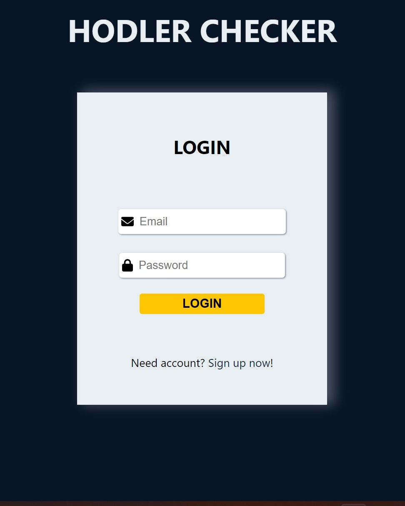
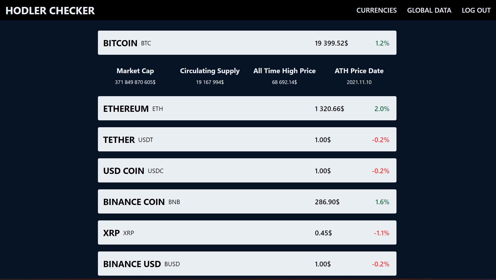
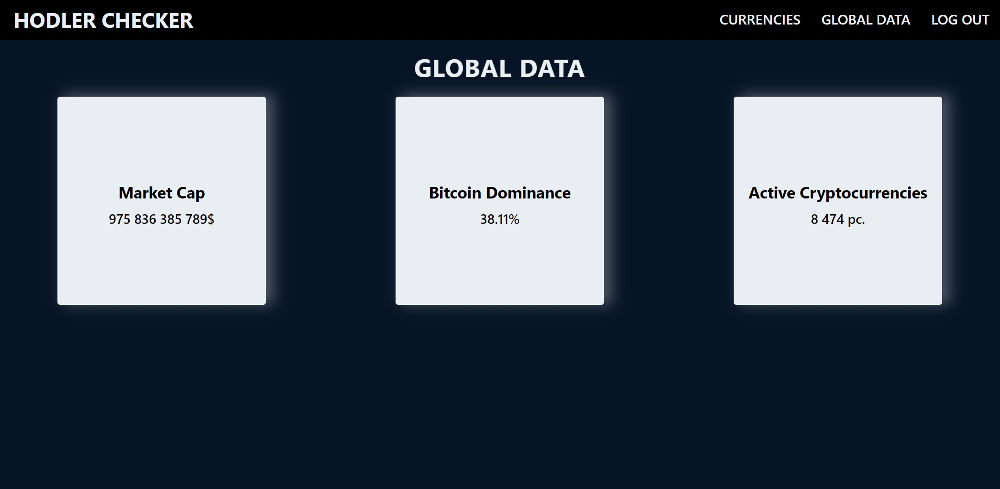

 # HODLER checker

**[CHECK IT LIVE!](https://hodler-checker.vercel.app/)**

## ABOUT

This React app get API data with `Axios` from the [Coinpaprika API](https://api.coinpaprika.com). You can check the current prices, 24H volume, market cap, circulating supply, All Time High price and date of the first 30 ranked crypto currencies. Also you can find some global data from the crypto market. The app has a dummy authentication, you have to add your username, email and password to sign up, and email and password to log in. Password stored in the local storage hashed by `bcrypt`.
To navigate between pages I used React Router 6.

**Sources**

  - [FontAwesome Icons](https://www.npmjs.com/package/@fortawesome/react-fontawesome)
  - [React Hot Toast](https://react-hot-toast.com/)
  - [Coinpaprika API](https://api.coinpaprika.com)
  - [SASS](https://sass-lang.com/)
  - [React Accessible Accordion](https://www.npmjs.com/package/react-accessible-accordion)
  - [Bcrypt](https://www.npmjs.com/package/bcryptjs)

**Screenshots**

Here you can login, if you have an account, or you can go to the signup page with the link.

This is the signup page where you can register with you username, email and password. After sign up it redirects you to the login page.

If you logged successfully, you can see the first 30 ranked crypto currencies with prices and the 24H volume. If you click to the currency bar, more data will be shown. Above you can see the navbar, where you can navigate between the currencies, global data, or you van log out.

This is the global data page, you can see here some data from the global crypto currency market.
