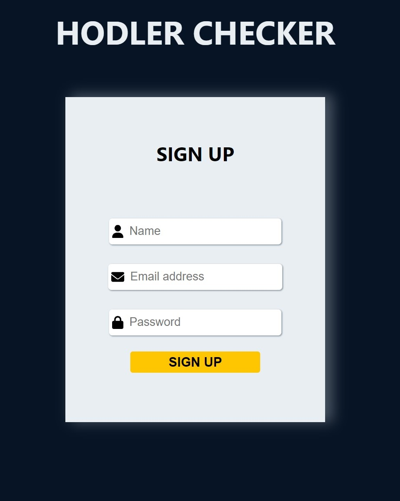

 <h1>Hodler Checker</h1>

 <h3>Check out <a href="https://hodler-checker.vercel.app/">live</a>!</h3>

**About**

This React app get API data with Axios from the <a href="https://api.coinpaprika.com/">Coinpaprika API</a>. You can check the current prices, 24H volume, market cap, circulating supply, ath price and date of the first 30 ranked crypto currencies. Also you can find some global data from the crypto market. To check the datas you have to sign up and log in with your email and password which stored with the browser's local storage.
To navigate between pages I used React Router 6.

**Sources**

  - <a href="https://www.npmjs.com/package/@fortawesome/react-fontawesome">Fontawesome Icons</a>
  - <a href="https://react-hot-toast.com/">React Hot Toast</a>
  - <a href="https://api.coinpaprika.com/">Coinpaprika API</a>
  - <a href="https://sass-lang.com/">SASS</a>
  - <a href="https://www.npmjs.com/package/react-accessible-accordion">React Accessible Accordion</a>

**Screenshots**

